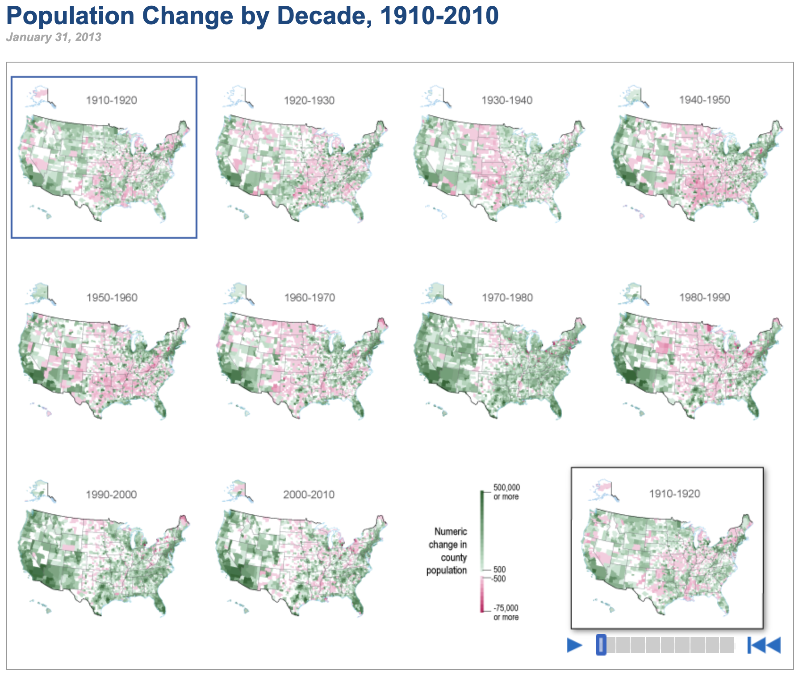
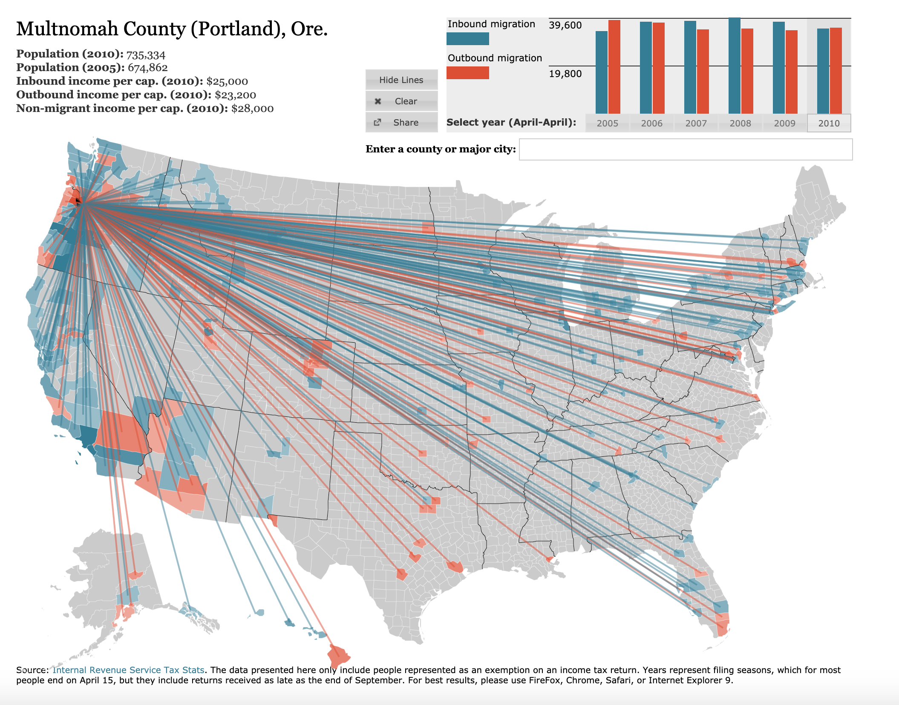
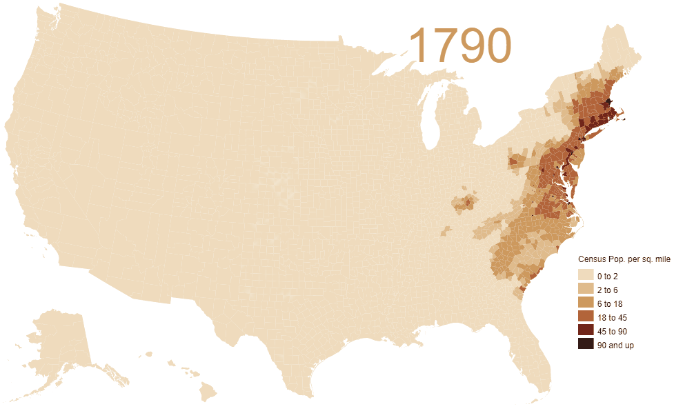
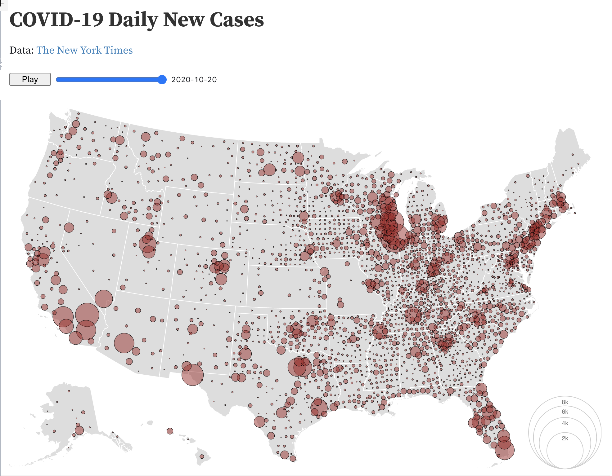

# Demographic Drift in America (2009-2018)

1. Brief articulation of proposal
    - We're interested in looking into racial population proportions in each US zip code. Using census data from the Python census module, we'll be looking at population proportions by racial group for each year between 2009-2018. 
    - We will aggregate this data in pandas, export the aggregations into a JSON format, and use that data to construct a D3 timeline map. 
    - We hope to include interactive elements such as: a slider/dropdown to choose the displayed year, a dropdown to choose a specific demographic group, and zoom/scroll capabilities.

2. Link to data resources
    - Census Python module (https://github.com/datamade/census)
    - TopoJSON layers for US maps (https://github.com/jgoodall/us-maps)

3. 3-4 shots of others' viz
     
    
    
    
    
    

4. Sketch of design

5. Link to repo
    - https://github.com/troypramsey/group_project2