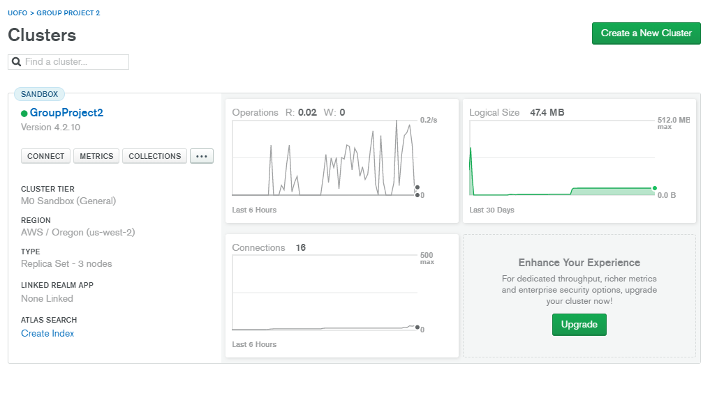
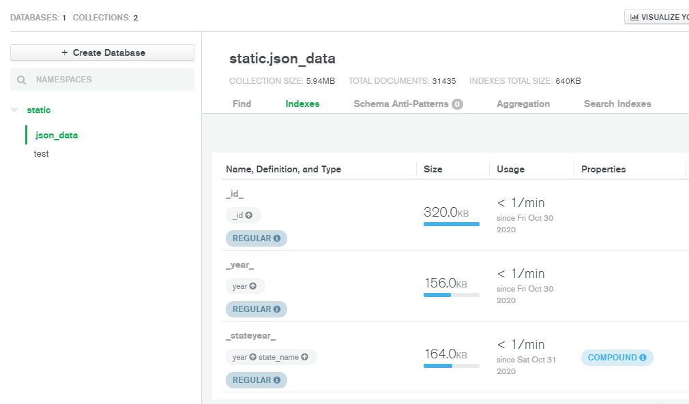
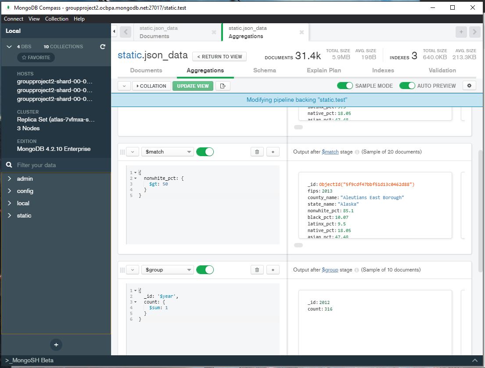
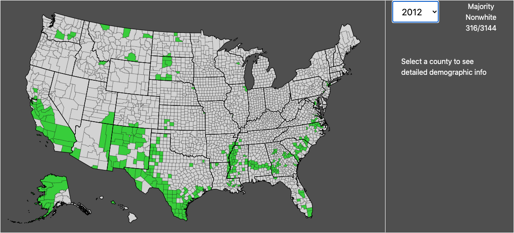
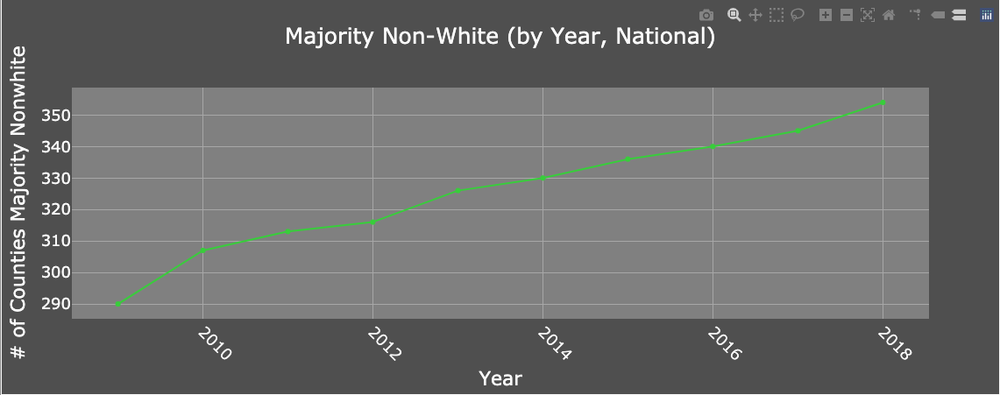
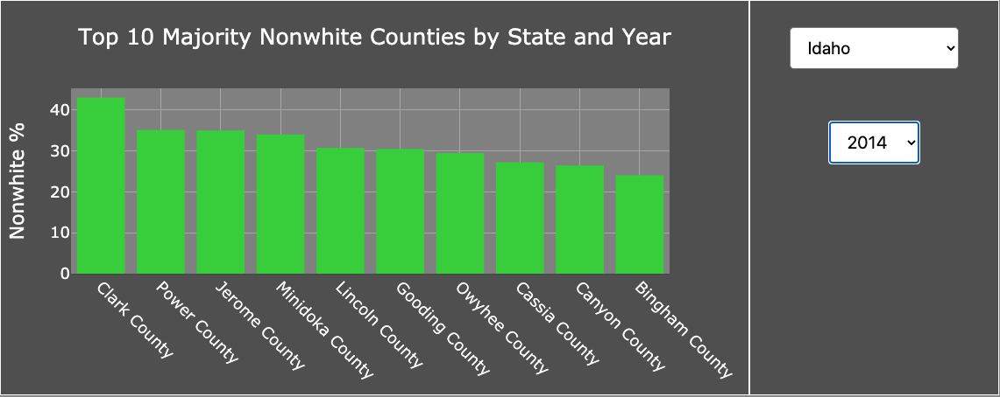

# US Racial Demographic Shift: 2009-2018

### Q: Is the US becoming more diverse?
After some exposure to the US Census module in Python, we wanted to somehow combine census data with JavaScript to build interesting maps and charts. In exploring the data, we discovered various changes in demographic proportions across multiple US counties. We've always *heard* that the US was becoming more diverse year on year, but we wanted to see it, specifically whether that diversification was stretching across all of the country's geography.

### Data
Our data was sourced calling the US Census Bureau API using the Census module in Python. We pulled in data for the five major racial/ethnic categories, determined each category's proportion of a given county's population, and saved each year's worth of data into a dataframe using Pandas. We exported these dataframes into JSON objects and loaded them into MongoDB.    
We then deployed the objects to a Mongo cluster for cloud access to data so as to mitigate the need to recreate all files locally on a given machine. We used indexing to ensure that each county in each year was its only single document, rather than needing to return all bulk data with our calls.  
In building our visualizations, we noticed that the asynchronous nature of JavaScript kept outpacing API calls, where our visualizations construct themselves without the requisite data! This was handled by creating aggregations through MongoDB pipelines in order to create *views* of the data we needed.  

### Visualizations
We chose to use two types of visualizations:
- A responsive map built entirely in base D3  
- Two charts in Plotly.js, one static line chart to show raw national change over time...   ...and one interactive bar chart to give access to the top ten highest proportion nonwhite majority counties by any given state or year.  

### Results
Over the course of ten years, 64 counties in the US became majority nonwhite on top of the counties that already were. Overall, by the year 2018, 11% of all counties in the US were majority nonwhite, a 2% increase from 2009. We did not look at increases in *already* majority nonwhite counties, so this number does not represent an overall percentage increase in demographic diversity country-wide. Rather, this shows a *geographic* percentage increase and illustrates changes in demographic distribution.

### How to Run the App
- Pull down the repository [here](https://github.com/troypramsey/group_project2).
- All necessary Python modules are available in the requirements.txt file. We recommend using pip to install all of them into a new virtual environment, as some modules are inaccessible to Conda.
- Once all necessary modules are installed into your environment, navigate to the root folder of the repository and use "python app.py" in your command line.
- Click the link to your local host in the flask response to open the web app.
- All API call instructions can be found using the 'API' link in the site navbar. Feel free to query any state or year, as the cluster connection has been established using safe read-only parameters with a direct URI.
- If you decide you want to recreate our JSON files on your own machine you will need a US Census API key. Create a Python file in the root directory, call it config.py, and save your API key into a string variable called 'api_key'. This variable is referenced for all census calls in the data wrangling python file. The wrangling file will save ten JSON files into the 'data' directory, one for each year called.